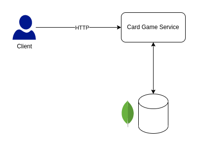
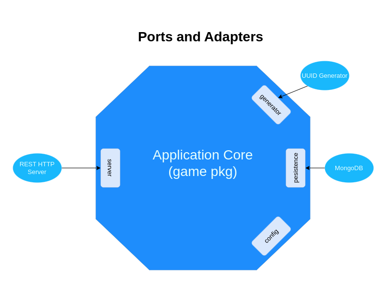

# Card Game Service
An RESTFul HTTP API build using Golang for managing decks and cards for games.

## Architecture Diagrams



## Features
* Create Deck
* Open Deck
* Draw Cards from an existing Deck

## Tech/Tools
* [Golang](https://go.dev/) as a Programming Language
* [MongoDB](https://www.mongodb.com/) as a database
* [Gin](https://github.com/gin-gonic/gin) as a WEB framework
* [Testify](https://github.com/stretchr/testify) as a basic testing framework
* [Testcontainers](https://golang.testcontainers.org/) as a tool for creating integration and E2E tests 
* [Baloo](https://github.com/h2non/baloo) as s tool for creating E2E tests

**NOTE**: This project follows [golang-standards project-layout](https://github.com/golang-standards/project-layout)

## Local Development

### Prerequisites
* [Docker 20+](https://www.docker.com/)
* [Golang 1.17+](https://go.dev/)
* [GNU Make](https://www.gnu.org/software/make/)

### How to run tests
```shell
make test
```

### How to run HTTP server
```shell
docker compose up -d
```
```shell
make start
```

### How to build binary
```shell
make build
```